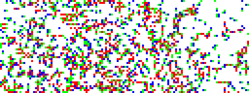

# brainbow

An implementation of a cellular automata I made up awhile ago. I'm told it's similar to "Brian's Brain". There are four states, red, green, blue, and blank.

---

CLI usage:

    -s --savepic f  Save a pic of each iteration to f, appended _xxx.png.
    -i --iterate n  Iterate n times, print the board at each iteration
    -p --print      Print the image to console during each iteration.

    python3 rgblife.py input.png -s output -i 300
    # Iterates 300 steps of the simulation, outputs output_000.png, output_001.png, etc.

